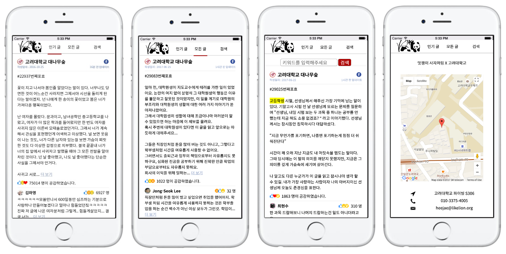

# 대-하!(대숲하이의 줄임말)

신촌 해커톤 11조 - 고려대팀

>> [ 해커톤 발표 자료 : https://github.com/poongnewga/Presentation_For_DaeHa ](https://github.com/poongnewga/Presentation_For_DaeHa)

대학생들 사이에서 인기있는 익명 게시판 대나무숲!

너무 많은 글, 묻혀버리는 재미도 감동도 없는 글 지겨우셨죠?

재미와 감동이 검증된 인기있는 게시물만 따로 모아서 보여주는 대-하!

모바일웹에 최적화된 네이티브 앱과 같은 UI/UX를 가지고 있습니다.

AJAX를 적극 활용하여 SPA을 최대한 구현해보려고 노력했고,

Facebook과 같은 SNS에 필수적인 무한 스크롤 기능,

정렬 및 검색 기능 등을 구현해봤습니다.

주로 사용한 기술은 다음과 같습니다.

 * Google 지도 API
 * Facebook API
 * Rails Action Job - 백그라운드 작업
 * jQuery
